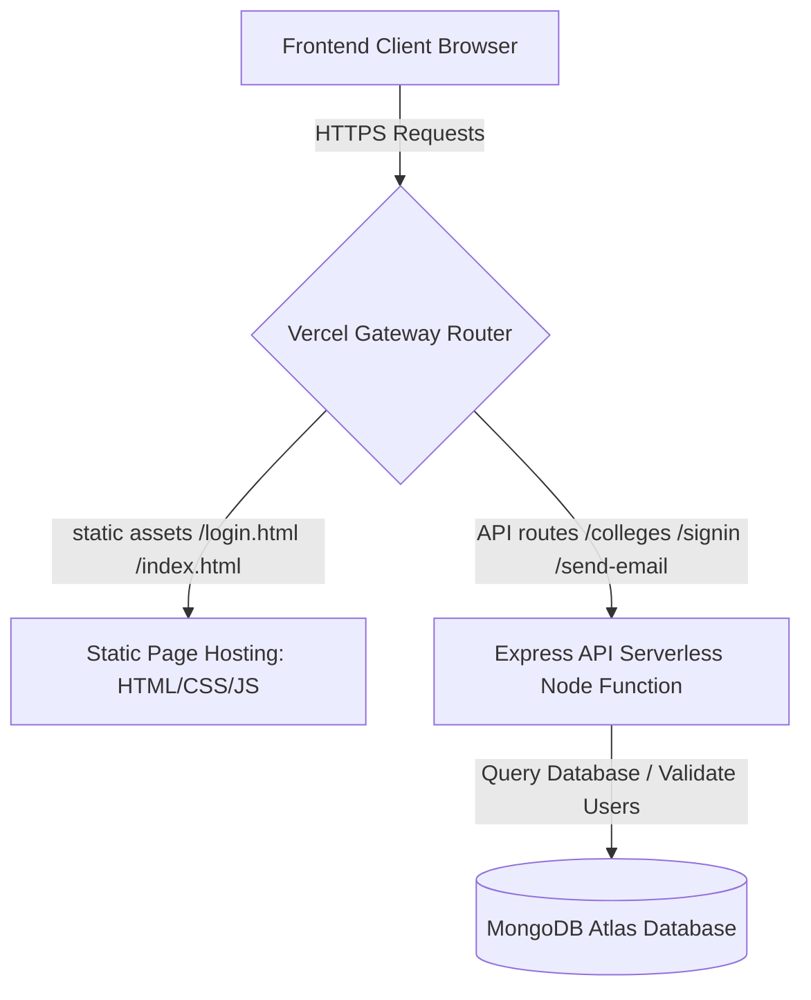

# CollegeAtlas | Global College Finder

[](https://global-college-finder.vercel.app/)
[](#)
[](#)

CollegeAtlas is a premium, high-performance web application designed to help students discover and research universities across the globe. Built with a modern, glassmorphic dark-theme UI, it features smooth entrance animations, particle effects, lightning-fast client-side filtering, automatic spelling suggestions, and an optimized write-through caching server architecture.

---

## 🗺️ System Architecture

CollegeAtlas is built using a decoupled Client-Server architecture designed to run seamlessly in both local environments and cloud serverless infrastructures like Vercel.



### 1. Architectural Patterns
*   **Server-Side Pagination & Search**: Queries university records in the MongoDB Atlas cluster dynamically using pagination parameters (page, limit). Paging queries utilize fast count operations, skip offsets, and limit checks. When a search yields no exact matches, spelling suggestions are generated based on Levenshtein-distance string comparisons.
*   **Dynamic API Resolution**: The client dynamically checks the hosting context. If hosted on a cloud domain (e.g., Vercel), it makes relative HTTP requests to Vercel's serverless gateway. During local development, it falls back to querying the backend port (default: `http://localhost:3000`).
*   **Zod Data Validation & Bcrypt Hashing**: Decoupled validation schemas ensure incoming payloads are vetted before reaching database models. Passwords are salted and hashed (10 rounds) using Bcrypt.

---

## 📂 Repository Directory Layout

The project keeps its server and client code neatly organized. Root-level legacy folders are preserved to prevent breaking older development setups.

```text
Global College Finder/
├── backend/                  # Express REST API Server
│   ├── auth/                 # Authentication middleware
│   │   └── auth.js           # JWT verification cookie parser middleware
│   ├── database/             # Mongoose connection & database management
│   │   ├── db.js             # DB Connection (Primary Atlas / Fallback Local MongoDB)
│   │   └── importColleges.js # Seed tool parsing JSON arrays into Mongoose
│   ├── models/               # Mongoose DB schemas
│   │   ├── dataModels.js     # University database schema
│   │   └── userModel.js      # User database schema
│   ├── router/               # Express routing tables
│   │   ├── contactRoute.js   # Contact form submission router
│   │   ├── dataRouter.js     # College query & Levenshtein router
│   │   └── userRoute.js      # Sign-up, sign-in, and log-out router
│   ├── validators/           # Zod schema definitions
│   │   └── validate.js       # Email structure & password complexity validators
│   ├── config.env            # Server environment variables configuration
│   ├── server.js             # Server entry point & CORS configuration
│   └── package.json          # Node dependencies & project scripts
│
├── frontend/                 # Client UI (Vercel static folder)
│   ├── images/               # Illustration assets (aboutus-img, signup-character)
│   ├── index.html            # Primary Dashboard (Tailwind + Particles + Modals)
│   ├── login.html            # Premium glassmorphic sign-in page
│   ├── signup.html           # Premium glassmorphic sign-up page
│   └── script.js             # Client controller (auth validation, query filters, toasts)
│
├── vercel.json               # Serverless deployment configuration
└── .gitignore                # Git ignore configuration
```

---

## 🛠️ Tech Stack & Key Technologies

### Frontend
*   **HTML5 & CSS3**: Semantic page structures and custom micro-animations (entrance reveals, atmospheric glows).
*   **Tailwind CSS (v3)**: Fast utility styling coupled with custom theme extensions configured inside `<script id="tailwind-config">` for dark modes and custom palettes.
*   **Vanilla JavaScript (ES6+)**: Handles complex DOM mutations, toast notifications, slide-out details drawers, and state filter dropdowns.
*   **Axios**: Manages asynchronous HTTP requests with CORS credentials integration.
*   **HTML5 Canvas API**: Renders a lightweight, high-performance particle background animation without DOM lag.

### Backend
*   **Node.js & Express (v5)**: Clean modular routing table configurations.
*   **MongoDB & Mongoose**: Object-relational mapping, strict schema definitions, and automated indexing.
*   **Zod (v4)**: High-assurance JSON body validation schemas.
*   **JSON Web Tokens (JWT) & Bcrypt**: Secure token-signing system stored inside HTTP-Only, Secure, SameSite=None cookies.
*   **Nodemailer**: Connects securely to Google SMTP servers to dispatch inquiries.

---

## 💾 Database Schemas

### 1. User Model (`users` Collection)
Used for auth control. Email serves as the unique identifier.
```javascript
const userSchema = new Schema({
  email: {
    type: String,
    unique: true,
    required: true
  },
  password: {
    type: String,
    required: true
  }
});
```

### 2. University Model (`universities` Collection)
Normalizes standard domain names, links, and regional listings.
```javascript
const instituteSchema = new Schema({
  name: {
    type: String,
    required: true
  },
  domains: {
    type: [String],
    required: true
  },
  web_pages: {
    type: [String],
    required: true
  },
  country: {
    type: String,
    required: true
  },
  alpha_two_code: {
    type: String,
    required: true,
    maxlength: 2
  },
  state_province: {
    type: String,
    default: null
  }
});
```

---

## 🔌 API Endpoints Reference

All paths except registration/auth endpoints are protected by `authMiddleware` verifying valid JWT cookie payloads.

| HTTP Method | Route | Authentication | Payload (JSON Body / Query) | Success Response | Description |
| :--- | :--- | :--- | :--- | :--- | :--- |
| **POST** | `/signup` | Public | `{ email, password }` | `201` Success Message | Validates credentials structure, hashes password, and creates user account. |
| **POST** | `/signin` | Public | `{ email, password }` | `200` Success + HTTP-Only Cookie | Verifies user, signs JWT token, and writes Cookie. |
| **POST** | `/logout` | Public | None | `200` Success | Clears HTTP-only JWT verification token cookie. |
| **GET** | `/auth` | Protected | None | `200` `{ success: true }` | Verifies active session JWT presence. |
| **GET** | `/colleges` | Protected | `?country=India&page=1&limit=20` | `200` Paginated JSON Object | Main search query. Returns a paginated JSON response matching optional country filters. |
| **POST** | `/send-email` | Public | `{ firstName, lastName, email, message, communication, dataConsent }` | `200` Success | Dispatches client inquiries to head office via Nodemailer SMTP. |

---

## 🧠 Advanced Algorithms & Logic

### 1. Paginated MongoDB Search
The `/colleges` endpoint processes searches by:
1. Parsing the optional `country` search query, `page` offset (default: 1), and page `limit` (default: 20).
2. Counting matching records efficiently via `countDocuments()` to determine total pages and offsets.
3. Running a query with Mongoose `skip((page - 1) * limit)` and `limit(limit)` to fetch only the requested slice.
4. Extracting unique states for the matched country on page 1 to load the client dropdown filter dynamically.
5. If no records match, running the Levenshtein suggestion system.

### 2. Levenshtein-Distance Spelling Suggestions
If a user searches for a country that doesn't exist in the database or the external directory, the server tries to find a suggestion using string-matching algorithms:
1. **Substring Match**: Searches distinct cached countries for matching sequences (e.g., "indi" -> matches "India").
2. **Levenshtein Distance**: Calculates edit distances between input strings and distinct cached countries. If the edit distance is within the threshold (distance < 4), the closest country match is recommended back to the user (e.g. searching "Inda" -> recommends "India").

### 3. Zod Schema Verification Rules
Defined inside `validate.js` to safeguard login portals:
*   `email`: Enforces structural compliance, min 3, max 50 characters.
*   `password`: Enforces a minimum length of 8 characters, at least 1 uppercase letter, at least 1 lowercase letter, at least 1 number, and at least 1 special character (`!@#$%^&*`).

---

## 💻 Local Installation & Setup

### Prerequisites
*   Node.js installed (v18+ recommended)
*   MongoDB instance (either local installation or MongoDB Atlas cloud access)

### 1. Configuration Setup
Create a `config.env` file in the `backend/` directory with the following variables:
```env
PORT=3000
URL=mongodb+srv://<username>:<password>@cluster0.mongodb.net/collegefinder
JWT_SECRET=your_jwt_signing_token_here
EMAIL=your_office_gmail_here@gmail.com
PASSWORD=your_gmail_app_password_here
```
> [!NOTE]
> If using Gmail SMTP to send contact form submissions, you must generate a 16-character **App Password** from your Google Account Security panel instead of using your primary password.

### 2. Run Database Seeding
If you have a local list of colleges in a JSON file (e.g., `colleges.json`), you can seed it directly to your primary database database using the seed CLI tool:
```bash
cd backend
npm run db:import path/to/colleges.json
```
This utility clears existing collections and writes normalized, validated entries.

### 3. Run Backend Server
Install dependencies and run the nodemon development server:
```bash
cd backend
npm install
npm start
```
The console will log: `Server is running at 3000` and confirm connection to your MongoDB Cluster.

### 4. Open Client UI
Serve the `frontend/` folder. You can use standard client runners like the VS Code **Live Server** extension, or Python's HTTP server:
```bash
cd frontend
python -m http.server 8080
```
Open `http://localhost:8080` in your web browser. 

---

## 🚀 Cloud Deployment (Vercel)

The project includes a serverless routing descriptor (`vercel.json`) that manages static directory serving and routes API requests:
```json
{
  "version": 2,
  "builds": [
    {
      "src": "backend/server.js",
      "use": "@vercel/node"
    },
    {
      "src": "frontend/**",
      "use": "@vercel/static"
    }
  ],
  "routes": [
    {
      "src": "/(signup|signin|logout|colleges|auth|contact|send-email)",
      "dest": "backend/server.js"
    },
    {
      "src": "/(.*)",
      "dest": "frontend/$1"
    }
  ]
}
```
*   Requests to `/signup`, `/signin`, `/logout`, `/colleges`, `/auth`, `/contact`, and `/send-email` are handled by the node engine running the Express app.
*   All other routes default to static assets inside the `frontend/` folder, enabling clean URLs without showing `.html` extensions.
